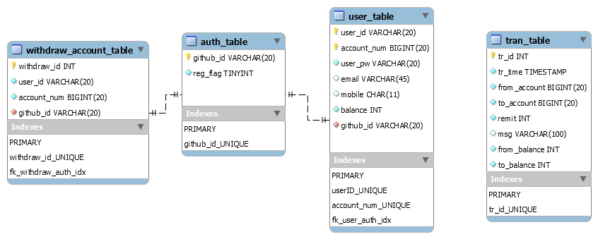

# Database

## `EER diagram`
This is the EER diagram of bankDB(1.2).


## test database
You can use test database in `db` directory by typing follwing command:
```bash
mysql -uroot -p$(cat root.pw) < test_data.sql
```
**IMPORTANT** Existing data in the database are deleted.
