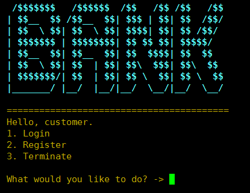
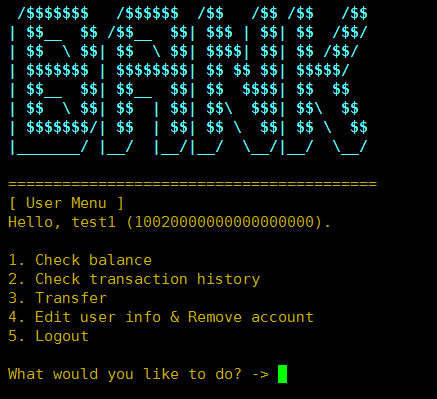
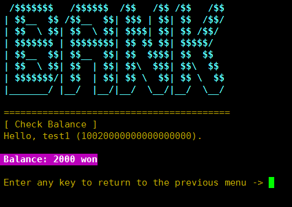
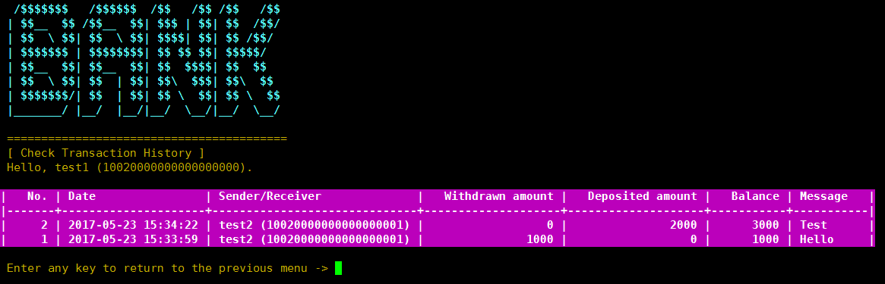
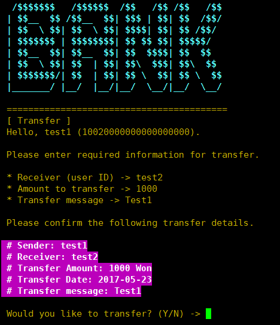
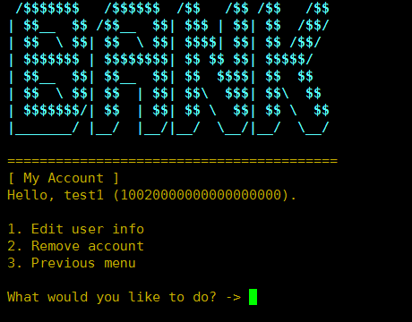
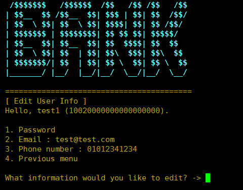
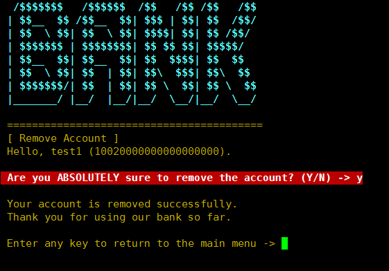

# Server & Beautiful UI
## File Description
* [main.py](main.py)
  * This file contains two main functions, login and register. 
  * In case of login, the system gets a username and password from user and sends a query to DB to check whether they are matched or not. 
  * If user succeeds to login, the system will show user menus as follows: `1) check balance, 2) transaction history, 3) transfer, 4) edit user info & remove account, 5) logout`.
  * In case of register, user should input github ID first for PGP authentication.
  * If a user succeeds to PGP authentication, the user should enter the following information for sign up: `1) username (user ID), 2) password, 3) email address, 4) phone number`.
  * The system checks whether entered username is existing user ID or not.
  * All of information are filtered by using context-sensitive regular expression.
  * Account number will be randomly generated by our system for account management.

* [util.py](util.py) : This file contains three functions shared across other files as follows: `1) a function to print a main logo of bank, 2) a function to receive all user input until `'\n'` entered,` and `3) a function to get password from user`.

* [balance.py](balance.py) : A function to get and show a balance of signed in user from DB. It simply shows a balance and user can go back to previous menu by entering any key.

* [history.py](history.py)
  * This function gets all transaction histories related to signed in user from DB, and shows them to the user with a beautiful table.
  * The information contained in the table is the followings: `1) Index, 2) transaction date, 3) sender/receiver, 4) withdrawn amount, 5) deposited amount, 6) balance, 7) transaction message`. 
  * In case of withdrawal history, deposited amount will be zero and in the contrary, withdrawn amount will be zero in case of deposit history. 
  * User can go back to the previous menu by entering any key.

* [transfer.py](transfer.py)
  * This function transfers money to another user. 
  * User should input a receiver's user ID and the amount to transfer. 
  * At this time, the bank system checks whether a receiver's user ID is valid or not. Also, the system does not allow receiver's user ID is same with signed in user. 
  * The amount to transfer is also filtered by the regular expression and the system does not allow if entered amount is larger than a balance. 
  * The system shows entered transfer information for reconfirmation, and asks whether you really want to transfer or not.
  * If user enters `yes`, the system updates the transaction in DB. If user enters `no`, the system only shows `transfer canceled` message. 
  * In both case, user can go back to the previous menu by entering any key.

* [mypage.py](mypage.py)
  * This file contains two main functions, a function to edit user information and a function to delete user account. 
  * Both of them are critical functions so we get a password again from user for identity verification first. 
  * User can modify password, email address and phone number.
  * In case of changing password or delete user account, user will be signed out and will return to the very first menu.

* [const.py](const.py) : This file contains all constants used in Bank system as follows: `1) context-sensitive error message, 2) ANSI code to colorize console, 3) regular expression to filter user input`, and so on.

## Screenshots of UI (selected)
### Main Menu

### User Menu (after login)

### Check Balance

### Check Transaction History

### Transfer

### My Account Page

### Edit User Info

### Remove Account

